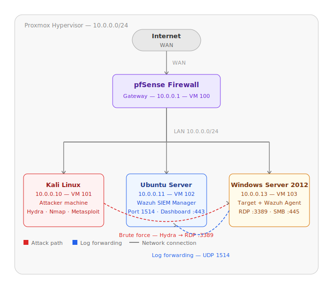
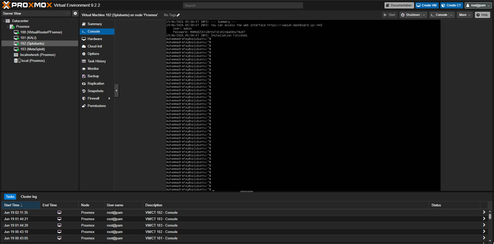
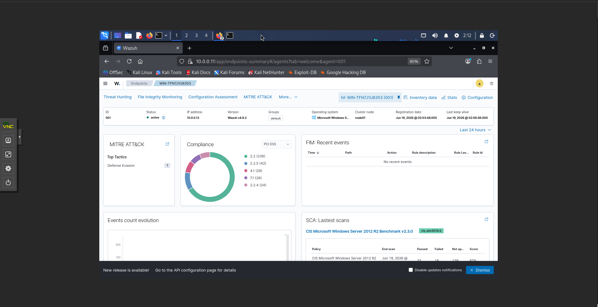
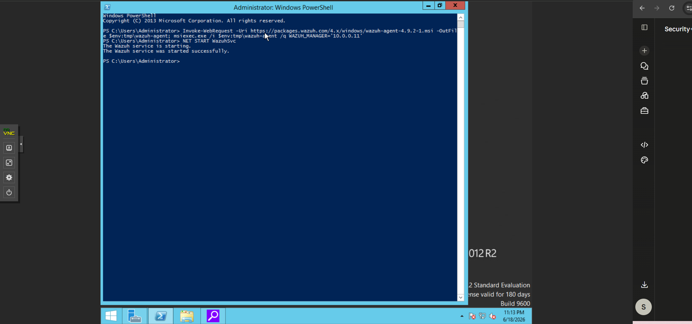

# SOC Home Lab

> Hands-on SOC environment built in Proxmox — covering SIEM deployment,
> threat detection, and incident response.

---

## Overview

Built a fully functional SOC home lab in Proxmox to develop hands-on
skills in SIEM deployment, threat detection, and incident response.
All attacks are simulated in an isolated lab environment.

---

## Network Diagram

---

## Lab Architecture

| Component | Role | IP Address |
|-----------|------|------------|
| pfSense | Virtual router / firewall | 10.0.0.1 |
| Ubuntu Server (Wazuh Manager) | SIEM brain — collects + analyzes logs | 10.0.0.11 |
| Windows Server 2012 | Target machine + Wazuh agent | 10.0.0.13 |
| Kali Linux | Attacker machine | 10.0.0.10 |

### Proxmox Environment

### Wazuh Agent Active on Windows Server

### Windows Server Target

---

## Tools & Technologies

| Category | Tools |
|----------|-------|
| Hypervisor | Proxmox VE |
| Firewall / Router | pfSense |
| SIEM | Wazuh 4.9 |
| Attacker tools | Kali Linux · Hydra · Nmap |
| Target OS | Windows Server 2012 |
| SIEM Manager OS | Ubuntu Server 22.04 |

---

## Projects

| # | Project | Status |
|---|---------|--------|
| 1 | SIEM Pipeline — Wazuh deployment and agent configuration | ✅ Complete |
| 2 | [RDP Brute Force Detection](brute-force-detection/) — Hydra → Wazuh, MITRE T1110 | ✅ Complete |
| 3 | Recon Detection — Nmap scan detected by Wazuh | 🔄 In Progress |
| 4 | Incident Report Writing | 🔄 Coming Soon |
| 5 | Alert Tuning — reduce false positives | 🔄 Coming Soon |

---

## Skills Demonstrated

- SIEM deployment and configuration (Wazuh 4.9)
- Host-based intrusion detection (HIDS) via Wazuh agent
- Network segmentation and firewall rules (pfSense)
- Brute force attack simulation and detection (Hydra → RDP)
- MITRE ATT&CK mapping — T1110 (Brute Force), T1046 (Network Scan)
- Log analysis and threat hunting in Wazuh dashboard
- Linux CLI administration (Ubuntu, Kali)

---

## Certifications

| Certification | Status |
|---------------|--------|
| CompTIA Security+ SY0-701 | 🔄 In Progress — target July 2026 |
| CompTIA CySA+ | 📋 Planned post-employment |

---

## Career Target

Aspiring SOC Analyst Tier 1 — seeking MSSP or enterprise SOC roles
in Toronto. Open to remote opportunities across Canada.
