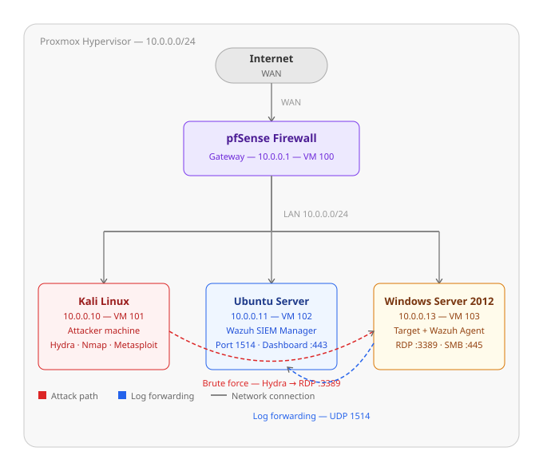
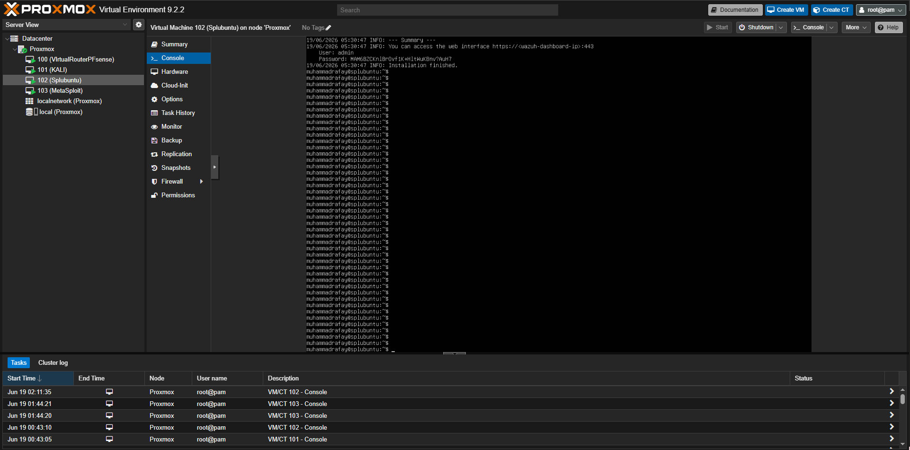

# SOC Home Lab
> Hands-on SOC environment built in Proxmox — covering SIEM deployment,
> threat detection, and incident response.

---

## Overview
Built a fully functional SOC home lab in Proxmox to develop hands-on
skills in SIEM deployment, threat detection, and incident response.
All attacks are simulated in an isolated lab environment.

---

## Network Diagram

---

## Lab Architecture
| Component | Role | IP Address |
|-----------|------|------------|
| pfSense | Virtual router / firewall | 10.0.0.1 |
| Ubuntu Server (Splunk Enterprise) | SIEM — collects, indexes, and analyzes logs | 10.0.0.11 |
| Windows Server 2012 R2 | Target machine + Splunk Universal Forwarder | 10.0.0.13 |
| Kali Linux | Attacker machine | 10.0.0.10 |

### Proxmox Environment

### Splunk Forwarder Active on Windows Server

### Windows Server Target

---

## Tools & Technologies
| Category | Tools |
|----------|-------|
| Hypervisor | Proxmox VE |
| Firewall / Router | pfSense |
| SIEM | Splunk Enterprise |
| Attacker tools | Kali Linux · Hydra · Nmap |
| Target OS | Windows Server 2012 R2 |
| SIEM Manager OS | Ubuntu Server |

---

## Projects
| # | Project | Status |
|---|---------|--------|
| 1 | [Brute Force Detection (T1110)](brute-force-detection-splunk/) — Splunk pipeline, Hydra attack, custom Sigma rule | ✅ Complete |
| 2 | [SOC Dashboards](brute-force-detection-splunk/LAB2-DASHBOARDS.md) — Failed login monitoring, process creation auditing, network anomaly detection | ✅ Complete |
| 3 | Active Directory Attacks — Kerberoasting detection (T1558.003) | 🔄 Planned |
| 4 | Credential Dumping & Detection — Sysmon, LSASS, Pass the Hash | 🔄 Planned |
| 5 | Phishing Email Analysis | 🔄 Planned |
| 6 | Network Traffic Analysis — Wireshark | 🔄 Planned |

> **Note:** This lab was originally built on Wazuh SIEM. It was
> migrated to Splunk after infrastructure reliability issues, and to
> better align with SIEM tooling commonly requested in SOC Analyst job
> postings. The original Wazuh implementation is preserved in
> [`/brute-force-detection`](brute-force-detection/) for reference.

---

## Skills Demonstrated
- SIEM deployment, configuration, and pipeline troubleshooting (Splunk Enterprise, Universal Forwarder)
- Custom detection rule authoring (Sigma → SPL translation)
- Multi-panel SOC dashboard design (failed login monitoring, process creation auditing, network anomaly detection)
- Brute force attack simulation and detection (Hydra → SMB, MITRE T1110)
- Windows Security Event Log analysis (4624, 4625, 4688)
- Windows audit policy and firewall logging configuration
- MITRE ATT&CK mapping and detection-to-technique documentation
- Network fundamentals (TCP/IP, NAT, DNS) applied to real troubleshooting
- Linux CLI administration (Ubuntu, Kali)

---

## Certifications
| Certification | Status |
|---------------|--------|
| CompTIA Security+ SY0-701 | ✅ CERTIFIED |
| CompTIA Network+ N10-009 | 🔄 In Progress |

---

## Career Target
Aspiring SOC Analyst Tier 1 — seeking MSSP or enterprise SOC roles
in Toronto. Open to Network Administrator, NOC Analyst, and IT Support
roles as well. Open to remote opportunities across Canada.
