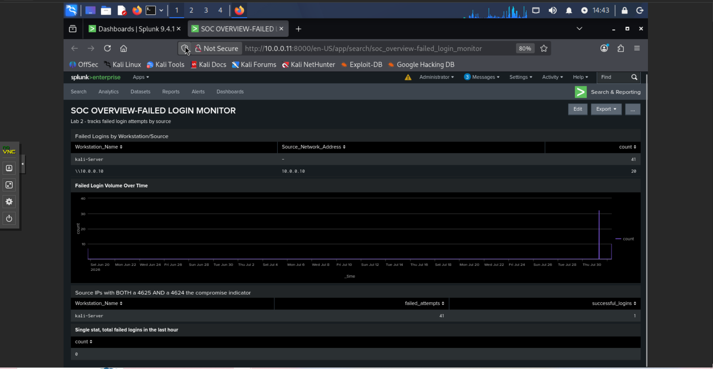
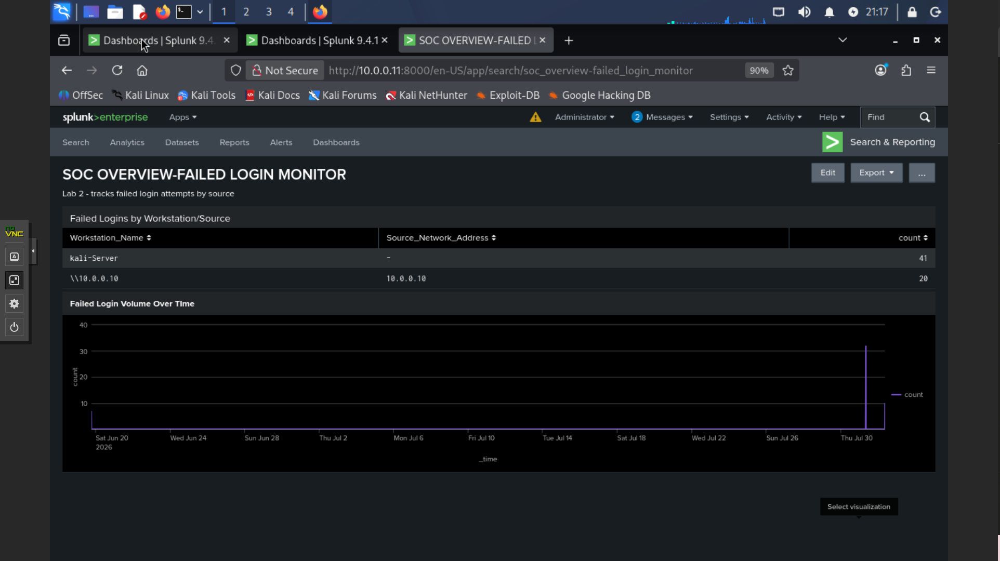
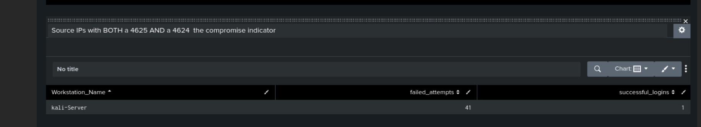
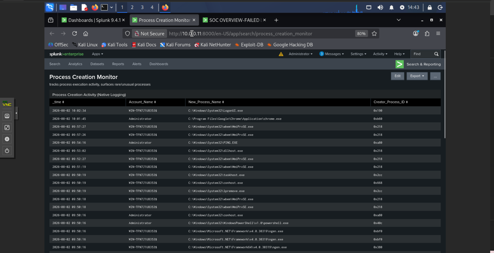
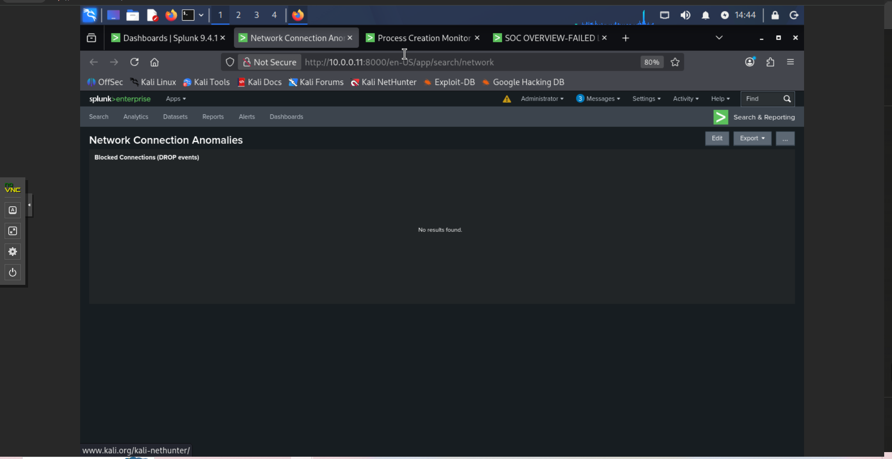
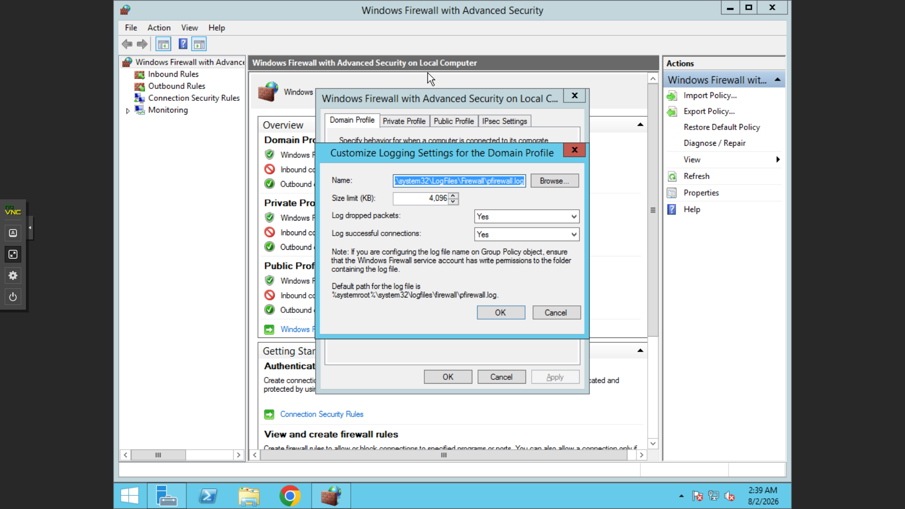

# Lab 2: SOC Dashboards (Splunk)

## Overview
Building on Lab 1's log pipeline, this lab focuses on turning ad-hoc 
Splunk searches into persistent, multi-panel dashboards — the kind of 
view a Tier 1 SOC analyst would keep open during a live shift.

Two dashboards were fully built; a third was scoped down given lab 
time constraints (see below).

---

## Dashboard 1: Failed Login Monitor



Four panels, organized around the investigative question *"is someone 
brute forcing us, and did they get in?"* rather than around a single 
log source:

**Panel 1 — Failed Logins by Workstation/Source**
```spl
index=main source="WinEventLog:Security" EventCode=4625 
| stats count by Workstation_Name, Source_Network_Address 
| sort -count
```
Groups by both `Workstation_Name` and `Source_Network_Address` after 
discovering some SMB-based failed logins don't populate the source IP 
field — `Workstation_Name` proved to be the more reliable field for 
catching all Kali-originated attack traffic.

**Panel 2 — Failed Login Volume Over Time**

```spl
index=main source="WinEventLog:Security" EventCode=4625 
| timechart span=10m count
```
A single sharp, isolated spike here is the visual signature of a fast 
brute force attack (like the Hydra run used in this lab). A gradual 
climb over hours/days would instead suggest a "low and slow" password 
spray attempt deliberately staying under alert thresholds to avoid 
lockout policies and volume-based detection.

**Panel 3 — Potential Compromise Indicator**

```spl
index=main source="WinEventLog:Security" (EventCode=4625 OR EventCode=4624) earliest=-24h
| stats count(eval(EventCode=4625)) as failed_attempts, count(eval(EventCode=4624)) as successful_logins by Workstation_Name
| where failed_attempts > 0 AND successful_logins > 0
```
This is the highest-priority panel on the dashboard — it answers 
whether an attacker succeeded, not just whether they tried. An empty 
result here is a *good* result. Time-bounding (`earliest=-24h`) was 
added after this panel initially returned a stale event from unrelated 
testing conducted a month earlier, demonstrating why operational 
dashboards must never run unbounded time ranges.

**Panel 4 — Failed Logins, Last 1 Hour**
```spl
index=main source="WinEventLog:Security" EventCode=4625 earliest=-1h 
| stats count
```
A single-value "pulse check" metric for at-a-glance monitoring.

---

## Dashboard 2: Process Creation Monitor



Enabled Windows process creation auditing (Event ID 4688) via Group 
Policy, since it is not logged by default.

**Panel 1 — Process Creation Activity**
```spl
index=main source="WinEventLog:Security" EventCode=4688 
Account_Name!="SplunkForwarder"
| table _time, Account_Name, New_Process_Name, Creator_Process_ID
| sort -_time
```
The `Account_Name!="SplunkForwarder"` filter excludes Splunk's own 
internal helper processes, which otherwise flood this panel with noise 
every minute.

**Finding:** native Windows Event ID 4688 logs the parent process as a 
numeric `Creator_Process_ID` only — not a resolvable process name. This 
limits investigation of parent-child process relationships (e.g. 
detecting `WINWORD.EXE → powershell.exe`, a classic malicious macro 
signature). This is a direct motivator for deploying Sysmon in a future 
lab, which logs full process lineage natively.

**Panel 2 — Rare/Unusual Process Names**
```spl
index=main source="WinEventLog:Security" EventCode=4688 
Account_Name!="SplunkForwarder"
| stats count by New_Process_Name 
| sort count
```
Sorted ascending (not descending) — rare, low-frequency processes are 
often more worth investigating than common ones, since malware or 
attacker tooling typically executes once rather than repeatedly.

**Panel 3 — Process Activity by Account**
```spl
index=main source="WinEventLog:Security" EventCode=4688 
Account_Name!="SplunkForwarder"
| stats count by Account_Name, New_Process_Name 
| sort -count
```
Sorted descending — here, high frequency is the signal (e.g. an 
account repeatedly launching PowerShell).

---

## Dashboard 3: Network Connection Anomalies (Scoped)



Unlike Dashboards 1–2, this required a new log source — Windows 
Security Event Logs don't contain raw network traffic data. Enabled 
Windows Firewall logging directly:



Configuration required troubleshooting a network profile mismatch — 
logging was initially enabled on the **Domain** profile, but the 
server was actually operating on the **Private** profile (unjoined to 
a domain), so no logs were generated until corrected.

**Panel 1 — Destination IP Frequency**
```spl
index=main sourcetype=pfirewall ALLOW 
| rex field=_raw "ALLOW\s+\S+\s+\S+\s+(?<dest_ip>\S+)"
| where dest_ip!="239.255.255.250" AND dest_ip!="ff02::1:2"
| stats count by dest_ip 
| sort count
```
Filters out routine multicast/SSDP background noise 
(`239.255.255.250`, `ff02::1:2`) to establish a clean baseline. All 
observed destination IPs in this lab session were explainable 
(internal infrastructure or legitimate Microsoft telemetry) — a 
correct and expected result for a quiet home lab environment.

**Panel 2 — Blocked Connections (DROP events)**
```spl
index=main sourcetype=pfirewall DROP 
| rex field=_raw "DROP\s+\S+\s+\S+\s+(?<dest_ip>\S+)\s+(?<src_port>\d+)\s+(?<dst_port>\d+)"
| table _time, dest_ip, dst_port
| sort -_time
```
Returned no results in this session — an honest and expected outcome, 
since no blocking activity occurred during testing.

**Scope note:** this dashboard was intentionally scoped to Windows 
Firewall log data given lab time constraints. A production environment 
would also ingest dedicated firewall/proxy appliance logs and a 
connection-volume timechart panel (matching the pattern used in 
Dashboard 1) for full network anomaly coverage — planned as a future 
enhancement.

---

## Key Takeaways
- A dashboard should be organized around an **investigative question**, 
  not a single log source — Dashboard 1 deliberately combines volume, 
  trend, and compromise-confirmation panels rather than shipping four 
  disconnected single-stat views.
- Always time-bound operational queries. An unbounded search mixed 
  a month-old unrelated test event into a "live compromise" panel 
  during this lab.
- Native Windows logging has real gaps (e.g. 4688's missing parent 
  process name) that directly justify tools like Sysmon in more mature 
  environments.
- Sort direction is a deliberate analytical choice: descending for 
  "high volume is suspicious" (logins, account activity), ascending 
  for "rarity is suspicious" (process names).
