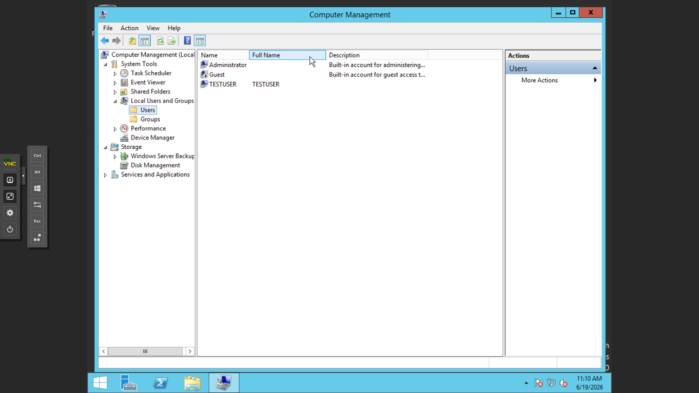
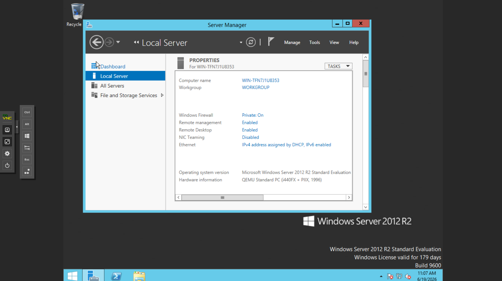
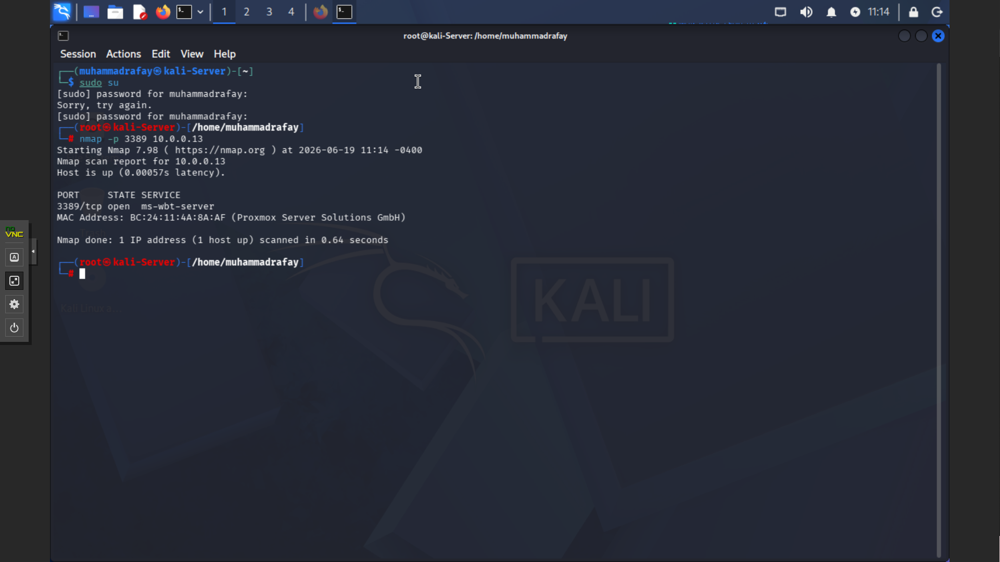
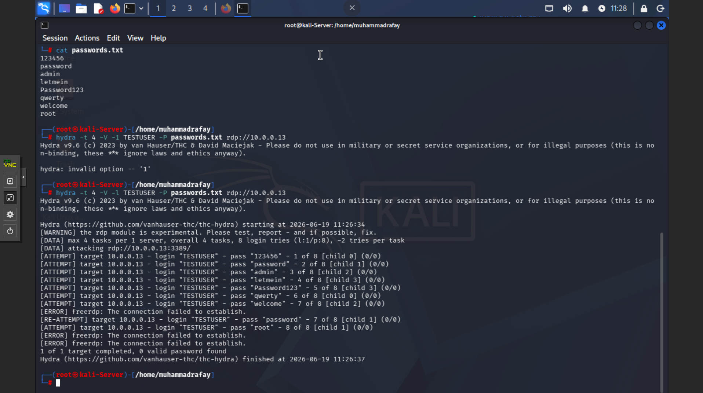
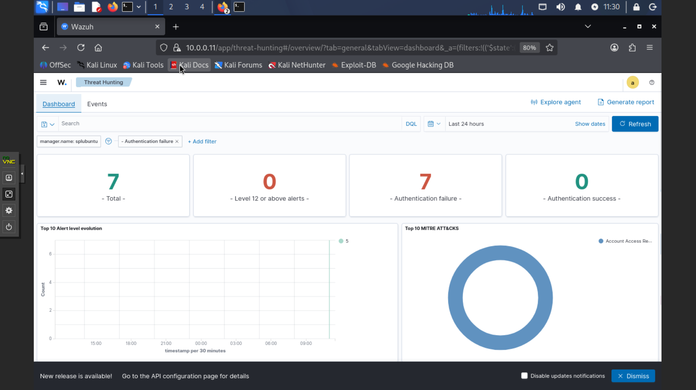
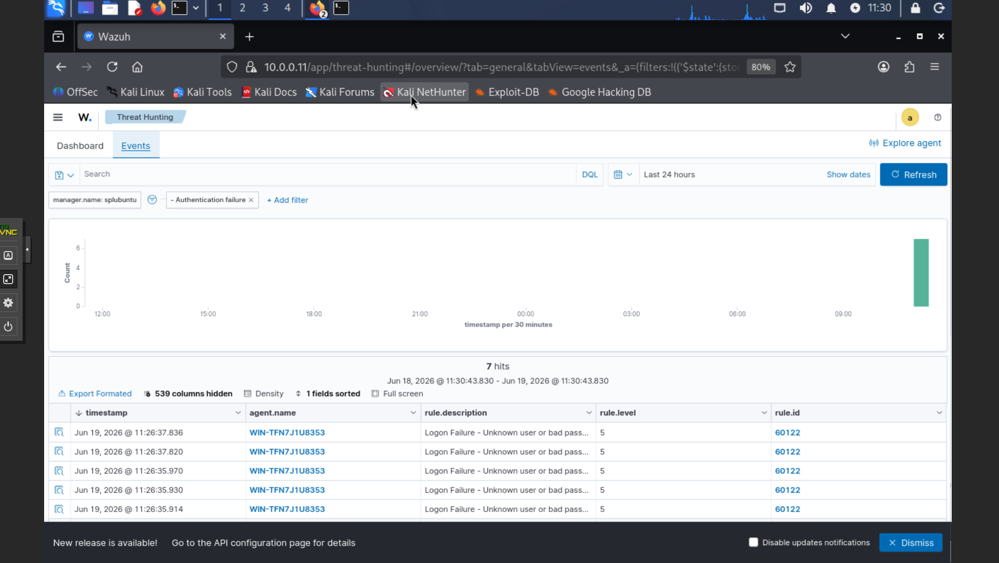

# Project: RDP Brute Force Detection

## Objective
Simulate an RDP brute force attack against a Windows
Server target and detect it using Wazuh SIEM, with the
alert mapped to the MITRE ATT&CK framework.

---

## Environment

| Machine | Role | IP |
|---------|------|-----|
| Kali Linux | Attacker | 10.0.0.10 |
| Windows Server 2012 R2 | Target + Wazuh Agent | 10.0.0.13 |
| Ubuntu Server | Wazuh SIEM Manager | 10.0.0.11 |

---

## Tools Used
- **Hydra** — brute force tool (Kali Linux)
- **Nmap** — reconnaissance / port scanning
- **Wazuh SIEM** — detection and alerting
- **RDP** — target service (port 3389)

---

## Step 1 — Target Setup

Created a test user account on the Windows Server target
to act as the account under attack.

Enabled Remote Desktop (RDP) on the target so the
attack surface was available on port 3389.

---

## Step 2 — Reconnaissance

From Kali, ran an Nmap scan to confirm the RDP service
was open before launching the attack.
nmap -p 3389 10.0.0.13

Result: port **3389/tcp open (ms-wbt-server)**, MAC
identified as a Proxmox VM.

---

## Step 3 — Attack Execution

Launched a brute force attack against RDP using Hydra
with a custom password list.
hydra -t 4 -V -l TESTUSER -P passwords.txt rdp://10.0.0.13

Hydra fired 8 login attempts against the TESTUSER
account. (Note: the RDP module is experimental, so Hydra
reported connection errors — but every attempt was still
logged on the target, which is what matters for detection.)

---

## Step 4 — Detection in Wazuh

The Wazuh dashboard detected the attack: **7 authentication
failures** with **0 successful logins**, automatically
mapped to a MITRE ATT&CK technique.

Drilling into the events confirmed the detail:

| Field | Value |
|-------|-------|
| Failed login events | 7 |
| Rule ID | 60122 |
| Rule level | 5 |
| Rule description | Logon Failure — Unknown user or bad password |
| Source agent | WIN-TFN7J1U8353 |

---

## MITRE ATT&CK Mapping
- **Tactic:** Credential Access
- **Technique:** T1110 — Brute Force

---

## Key Takeaway
The attack did **not** need to succeed to be detected. In
a real SOC, the failed authentication attempts themselves
ARE the detection signal — a spike in failed logins from a
single source is a classic brute force indicator that a
Tier 1 analyst would investigate and escalate.

---

## Skills Demonstrated
- Attack simulation (Hydra brute force over RDP)
- Network reconnaissance (Nmap)
- Endpoint preparation (Windows user/RDP config)
- SIEM log analysis and threat hunting (Wazuh)
- MITRE ATT&CK mapping (T1110)
- Understanding authentication-based attack indicators
