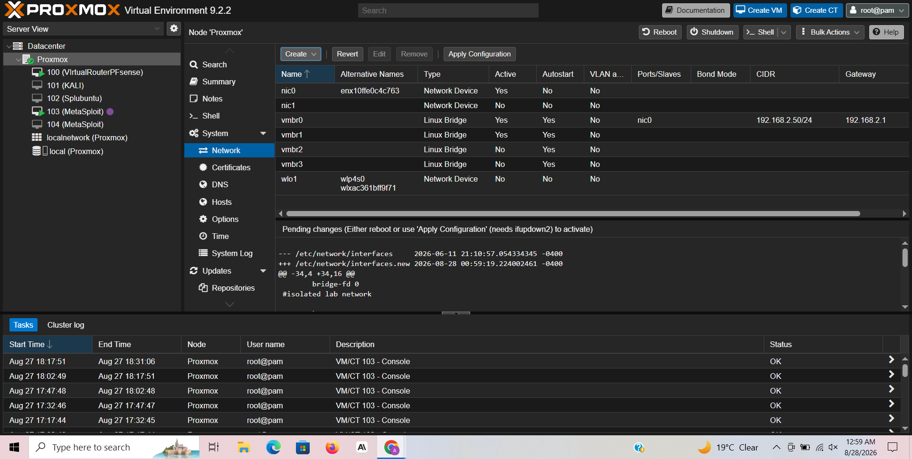
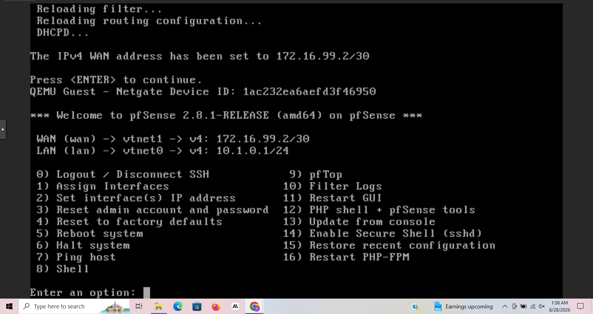
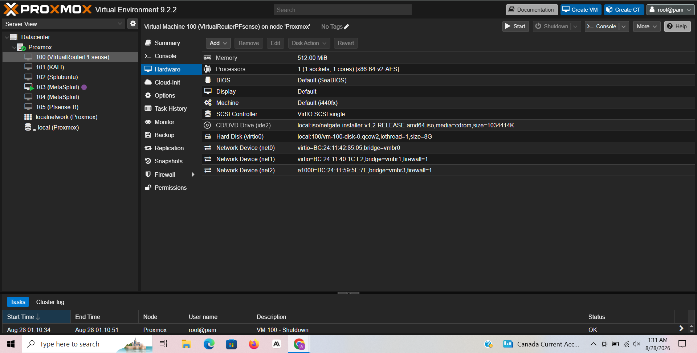
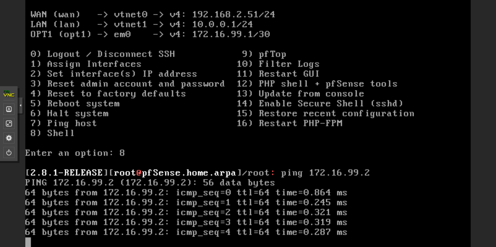
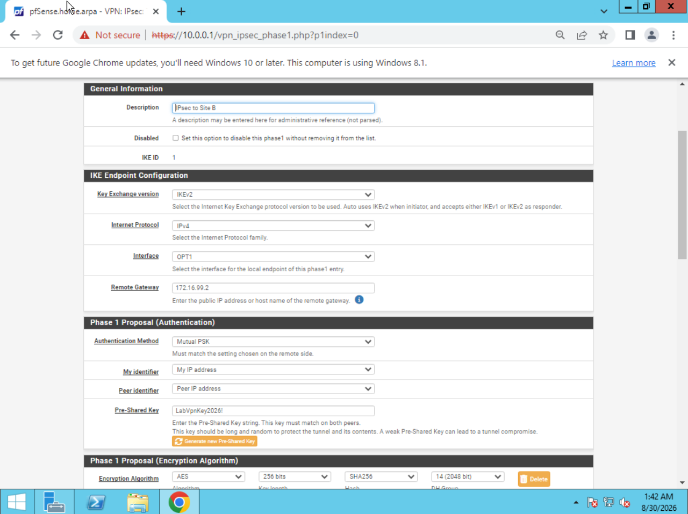
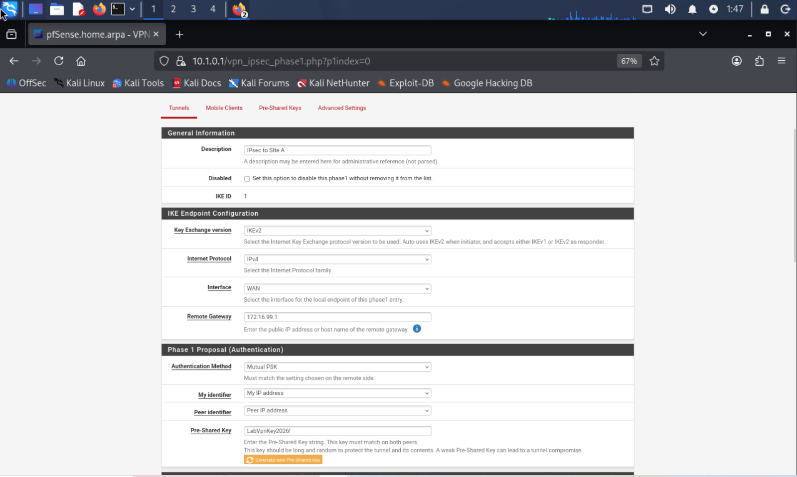
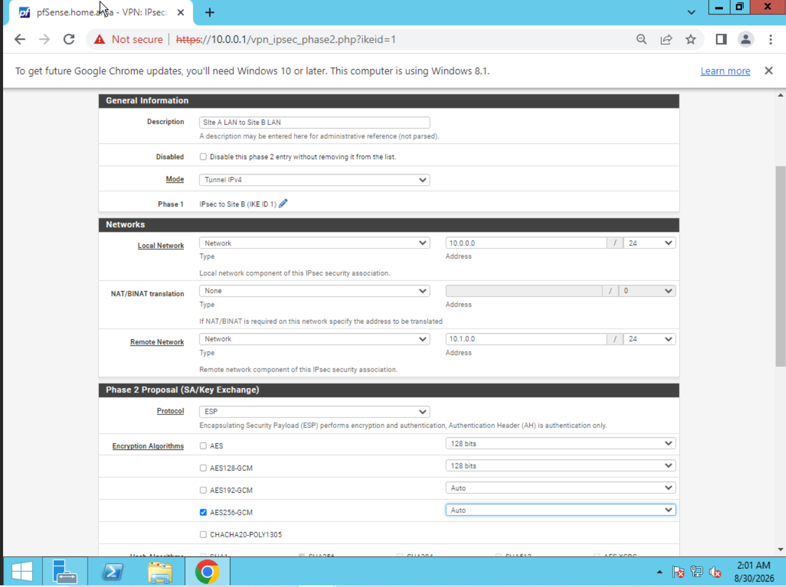
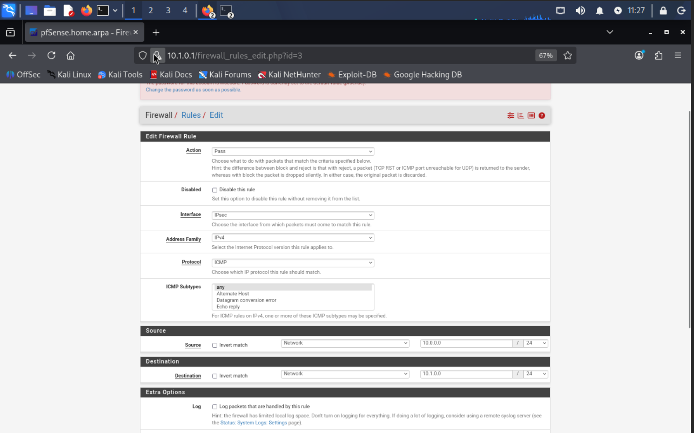
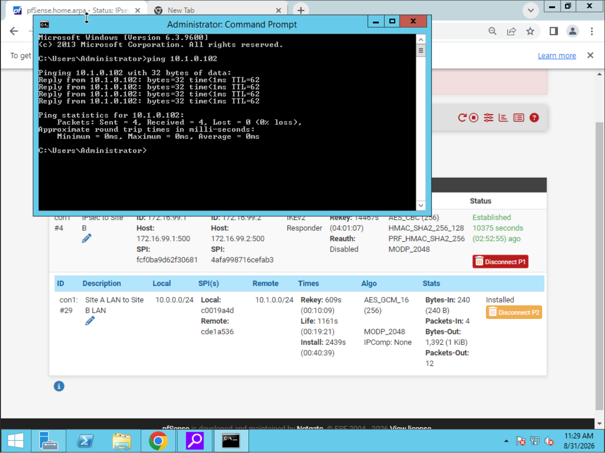
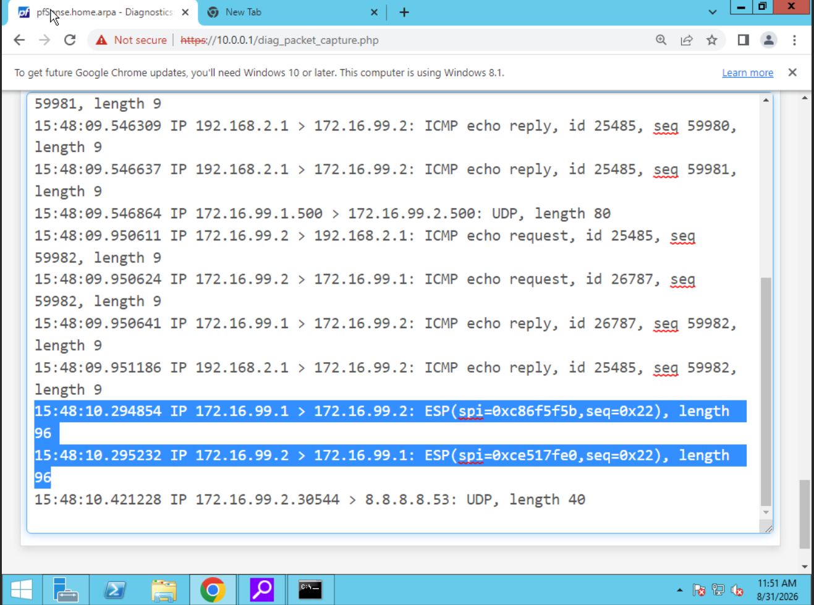

# Site-to-Site IPsec VPN Lab

> Two fully isolated network sites connected over an encrypted Site-to-Site VPN tunnel — built from scratch in Proxmox using pfSense, with packet-level proof that traffic crossing the link is genuinely encrypted.

---

## Objective

Simulate two separate office locations, each with its own independent network, and connect them securely over a private link the way a real organization would connect two branch offices over the public internet. The goal wasn't just to get a tunnel "up" — it was to prove, at the packet level, that the traffic crossing that link is unreadable to anyone observing the wire.

---

## Topology



Two new isolated Proxmox bridges were created to support this project:
- **vmbr2** — Site B's LAN
- **vmbr3** — a dedicated transit switch connecting the two pfSense routers, with no devices and no IP of its own

```
        ISP / Home Network (192.168.2.0/24)
                    |
              [ pfSense A ]
         WAN: 192.168.2.51/24
         LAN: 10.0.0.1/24  ── Site A LAN (10.0.0.0/24)
                                  └─ Windows Server: 10.0.0.101
        OPT1: 172.16.99.1/30
                    |
            Transit Switch (vmbr3)
              172.16.99.0/30
                    |
        WAN: 172.16.99.2/30
              [ pfSense B ]
         LAN: 10.1.0.1/24  ── Site B LAN (10.1.0.0/24)
                                  └─ Kali Linux: 10.1.0.102
```

**Environment:** Proxmox VE · pfSense 2.8.1-RELEASE (x2) · Windows Server · Kali Linux

---

## Interface & IP Configuration



Each pfSense router's interfaces were assigned and IP'd carefully, with WAN/LAN/OPT1 roles cross-verified against Proxmox's MAC address listings to avoid misassignment — a real issue hit and corrected during this build (see **Troubleshooting Log** below).



pfSense A's third interface (OPT1) and pfSense B's WAN interface were both connected to the transit switch (vmbr3) and assigned addresses on a dedicated point-to-point /30 subnet (172.16.99.0/30) — simulating the public-internet segment between two real office routers.

---

## Transit Link Verification



Before attempting any VPN configuration, basic reachability between the two routers was confirmed with a direct ping across the transit link (172.16.99.1 ↔ 172.16.99.2) — establishing that Layer 2 and Layer 3 connectivity were solid before adding encryption on top.

---

## IPsec Configuration

**Phase 1** (IKEv2, Mutual PSK, AES-256, SHA-256, DH Group 14) was configured on both routers, each pointing at the other's transit IP as its remote gateway:




**Phase 2** defines which traffic is actually allowed through the tunnel — each router's local LAN mapped against the other's remote LAN:



| Setting | pfSense A | pfSense B |
|---|---|---|
| Interface | OPT1 | WAN |
| Local IP | 172.16.99.1 | 172.16.99.2 |
| Remote Gateway | 172.16.99.2 | 172.16.99.1 |
| Phase 1 | IKEv2, Mutual PSK, AES-256, SHA-256, DH Group 14 | (identical) |
| Phase 2 | Local: 10.0.0.0/24, Remote: 10.1.0.0/24, AES256-GCM | Local: 10.1.0.0/24, Remote: 10.0.0.0/24, AES256-GCM |

---

## Troubleshooting Log

Documenting these because the debugging was the real learning — not the finished config.

**1. WAN/LAN interfaces were initially misassigned on first boot.**
Corrected by cross-referencing MAC addresses shown in Proxmox's Hardware tab against the pfSense console's interface list, rather than assuming interface ordering.

**2. DHCP silently stopped running after an interface reassignment**, on both routers independently. No error was shown — the symptom was a client stuck on an APIPA address. Diagnosed via `ps aux | grep dhcpd` showing no live process, then fixed by re-running interface setup and explicitly re-enabling DHCP.

**3. Transit link ping failed despite correct IPs on both routers.**
Diagnosed layer by layer instead of guessing:
- **ARP** confirmed Layer 2 connectivity was intact
- **Traceroute** showed zero response at any hop, ruling out a routing table issue
- **Firewall logs** revealed the actual cause: pfSense's default "Block private networks and loopback addresses" setting on a WAN-type interface was silently dropping all traffic from the private transit subnet

**4. IPsec tunnel showed "Established," but cross-site ping still failed.**



Isolated using IPsec's own Phase 2 byte counters: outbound bytes were incrementing, but inbound stayed at zero — proving the packet reached the remote router and was successfully decrypted, but never reached the LAN. Root cause: the dedicated **Firewall → Rules → IPsec** rule (a separate rule set from the router's normal interface rules) had its Source and Destination reversed.

---

## Results

**Cross-site ping**, Windows Server (Site A, 10.0.0.101) to Kali Linux (Site B, 10.1.0.102), succeeded end-to-end through the tunnel:



**Packet capture on the transit interface**, taken during that same ping test, shows the true proof of encryption:



```
IP 172.16.99.1 > 172.16.99.2: ESP(spi=0xc86f5f5b, seq=0x22), length 96
IP 172.16.99.2 > 172.16.99.1: ESP(spi=0xce517fe0, seq=0x22), length 96
```

No ICMP. No visible source or destination host addresses. No indication of what protocol or hosts are actually communicating — only two opaque, encrypted ESP packets between the tunnel endpoints. An observer on this wire with no access to the pre-shared key cannot determine that a ping ever occurred, what IPs were really talking, or even what protocol was in use.

---

## Skills Demonstrated

- Network segmentation and isolated multi-site design in a virtualized environment
- Router/firewall interface configuration and troubleshooting (pfSense)
- Site-to-Site IPsec VPN configuration (Phase 1/Phase 2, IKEv2, PSK authentication)
- Systematic, layer-based troubleshooting methodology (Layer 2 → Layer 3 → firewall/application layer)
- Packet analysis and verification using pfSense packet capture and Wireshark
- DHCP, NAT, and firewall rule administration

---

## Next Steps

- OSPF (multi-area), ACL, and NAT labs across a multi-router topology
- Integration into a single capstone lab combining this VPN, multi-site routing, network segmentation, and Active Directory into one environment
