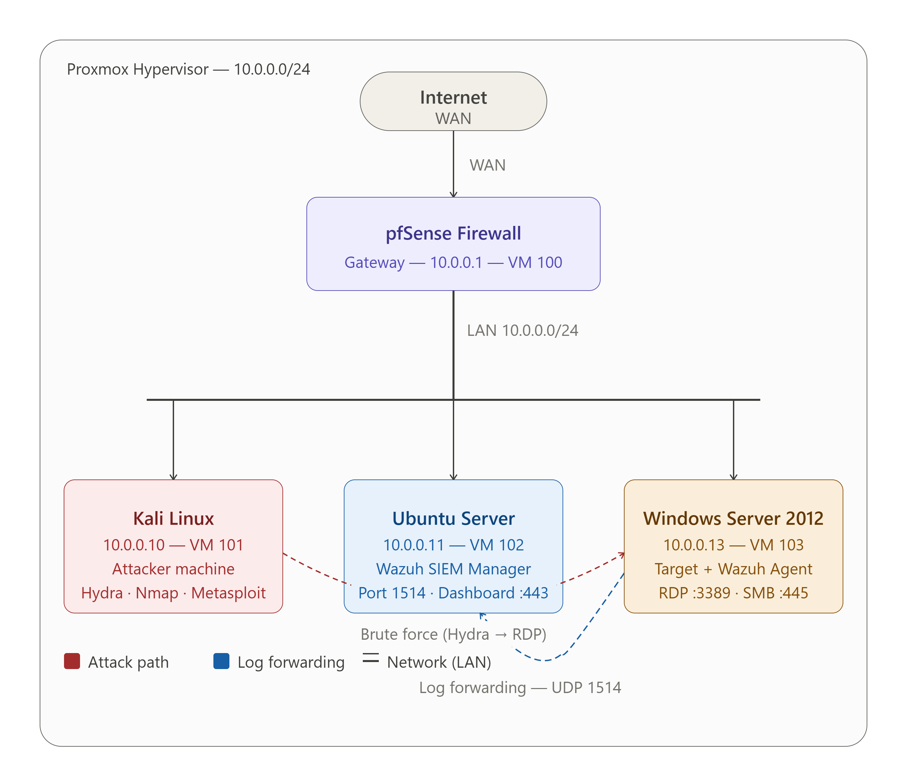
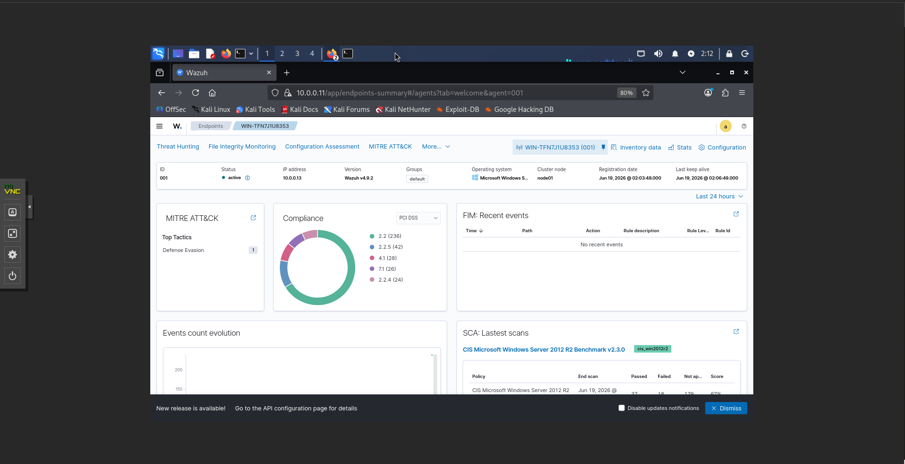
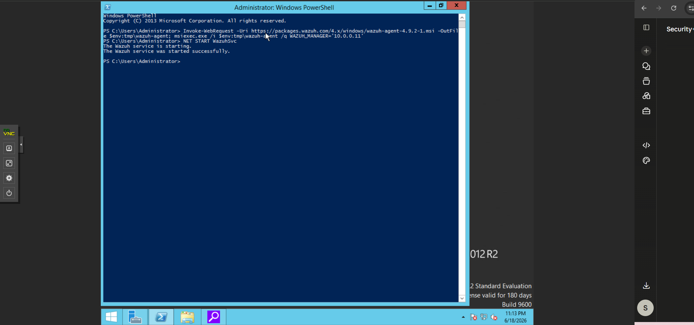

# SOC Home Lab

> Hands-on security operations environment built in Proxmox — covering SIEM deployment, threat detection, network defense, and incident response.

---

## Overview

A fully virtualized SOC and network security lab built from the ground up in Proxmox, designed to build real, defensible hands-on skill in SIEM operations, threat detection, and network infrastructure — not just theory. All attacks, detections, and infrastructure builds are simulated in an isolated lab environment with no production exposure.

This lab is under active development, with each project documented end-to-end: architecture, configuration, and the real troubleshooting encountered along the way.

---

## Network Diagram

---

## Lab Architecture

| Component | Role | IP Address |
|-----------|------|------------|
| pfSense | Virtual router / firewall | 10.0.0.1 |
| Ubuntu Server (Splunk Enterprise) | SIEM — collects, indexes, and analyzes logs | 10.0.0.11 |
| Windows Server 2012 R2 | Target machine + Splunk Universal Forwarder | 10.0.0.13 |
| Kali Linux | Attacker machine | 10.0.0.10 |

### Proxmox Environment

### Splunk Forwarder Active on Windows Server

### Windows Server Target

---

## Tools & Technologies

| Category | Tools |
|----------|-------|
| Hypervisor | Proxmox VE |
| Firewall / Router | pfSense |
| SIEM | Splunk Enterprise |
| Attacker tools | Kali Linux · Hydra · Nmap |
| Target OS | Windows Server 2012 R2 |
| SIEM Manager OS | Ubuntu Server |

---

## Projects

| # | Project | Status |
|---|---------|--------|
| 1 | [Site-to-Site IPsec VPN Lab](../site-to-site-vpn-lab/) — Two isolated sites connected via encrypted VPN tunnel, with packet-level (ESP) proof of encryption and a full troubleshooting log | ✅ Complete |
| 2 | [Brute Force Detection (T1110)](../brute-force-detection-splunk/) — Splunk ingestion pipeline, Hydra attack simulation, custom Sigma-to-SPL detection rule | ✅ Complete |
| 3 | [SOC Dashboards](../brute-force-detection-splunk/LAB2-DASHBOARDS.md) — Multi-panel dashboards for failed login monitoring, process creation auditing, and network anomaly detection | ✅ Complete |
| 4 | Multi-Site Network Infrastructure Lab — OSPF multi-area routing, ACL-based segmentation, and NAT across a multi-router topology | 🔄 In Progress |
| 5 | Active Directory Attack Detection — Kerberoasting (T1558.003) and credential dumping (Sysmon, LSASS, Pass-the-Hash) | 🔄 Planned |
| 6 | Integrated Enterprise Capstone Lab — a single environment combining multi-site routing (OSPF), network segmentation (ACLs), Site-to-Site VPN, Active Directory (OUs, security groups, NTFS permissions), and full SIEM monitoring across every layer | 🔄 Planned |

> **Note:** This lab was originally built on Wazuh SIEM. It was migrated to Splunk after infrastructure reliability issues, and to better align with SIEM tooling commonly requested in SOC Analyst job postings. The original Wazuh implementation is preserved in [`/brute-force-detection`](../brute-force-detection/) for reference.

---

## Skills Demonstrated

- Site-to-Site VPN design and troubleshooting (IPsec — Phase 1/Phase 2, IKEv2, PSK authentication)
- Layer-based network troubleshooting methodology (Layer 2 ARP → Layer 3 routing → firewall/application layer)
- SIEM deployment, configuration, and pipeline troubleshooting (Splunk Enterprise, Universal Forwarder)
- Custom detection rule authoring (Sigma → SPL translation)
- Multi-panel SOC dashboard design (failed login monitoring, process creation auditing, network anomaly detection)
- Brute force attack simulation and detection (Hydra → SMB, MITRE T1110)
- Windows Security Event Log analysis (4624, 4625, 4688)
- Windows audit policy and firewall logging configuration
- MITRE ATT&CK mapping and detection-to-technique documentation
- Router/firewall administration, ACLs, and NAT (pfSense)
- Packet-level traffic analysis and verification (tcpdump, Wireshark)
- Network fundamentals (TCP/IP, subnetting, NAT, DNS, DHCP) applied to real troubleshooting
- Linux CLI administration (Ubuntu, Kali)

---

## Certifications

| Certification | Status |
|---------------|--------|
| CompTIA Security+ (SY0-701) | ✅ Certified 
| CompTIA Network+ (N10-009) | ✅ Certified  
| Cisco CCNA (200-301) | 🔄 In Progress 

---

## Career Target

Aspiring Network Administrator / SOC Analyst Tier 1 — seeking Network Administrator, NOC, IT Support, or enterprise/MSSP SOC roles in Toronto. Open to remote opportunities across Canada.
